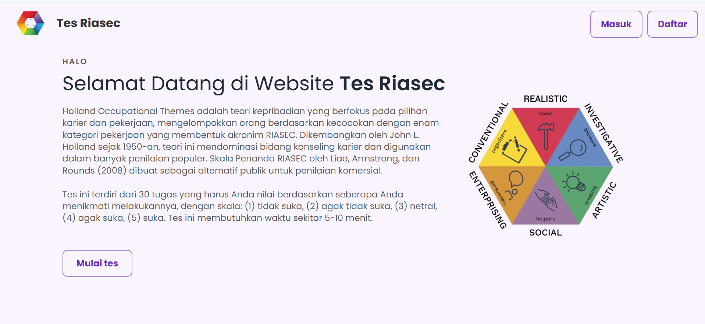
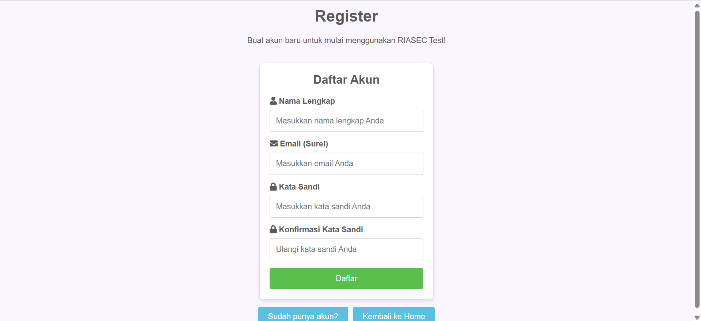
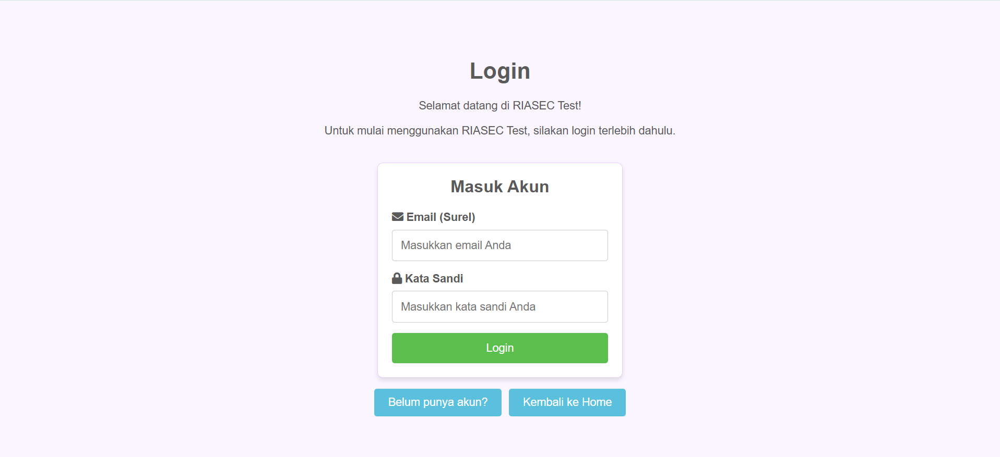
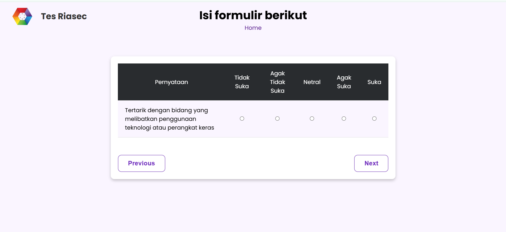
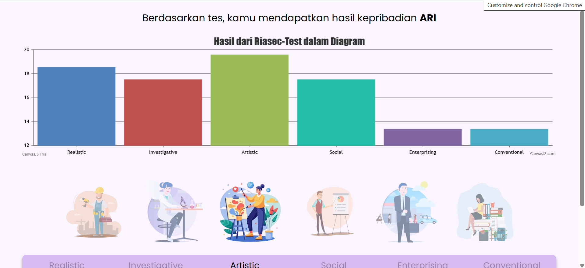

# RIASEC Test Web Application

RIASEC Test adalah aplikasi web berbasis PHP & MySQL yang digunakan untuk mengukur minat dan kecenderungan karier seseorang berdasarkan teori **RIASEC (Realistic, Investigative, Artistic, Social, Enterprising, Conventional)**.

Aplikasi ini memungkinkan pengguna untuk:
- Registrasi & login
- Mengisi tes RIASEC
- Melihat hasil tipe kepribadian RIASEC

---

## 🚀 Fitur Utama
- Autentikasi pengguna (Login & Register)
- Form tes RIASEC
- Perhitungan hasil RIASEC
- Menampilkan hasil tes
- Session management
- Database MySQL

---

## 🛠️ Teknologi yang Digunakan
- **PHP** (Native)
- **MySQL**
- **HTML5**
- **CSS3**
- **JavaScript**
- **XAMPP** (Apache & MySQL)
- **phpMyAdmin**

---
## 📁 Struktur Folder

```
Riasec-Test/
├── assets/                # Asset pendukung (gambar)
├── css/                   # File CSS
│   ├── login.css
│   └── style.css
│
├── includes/              # File PHP pendukung
│   ├── db.php
│   ├── header.php
│   └── footer.php
│
├── db.sql
├── index.php
├── login.php
├── logout.php
├── register.php
├── test_form.php
├── result.php
├── result.js
└── util_functions.php
```
---

## ⚙️ Cara Menjalankan Aplikasi

### 1️⃣ Persiapan
- Install **XAMPP**
- Pastikan **Apache** dan **MySQL** berjalan

### 2️⃣ Setup Project
1. Copy folder project ke: C:\xampp\htdocs\Riasec-Test
2. Buka phpMyAdmin : http://localhost/phpmyadmin
3. Buat database dengan nama: riasec_test
4. Import file: db.sql
5. Jalankan aplikasi: Buka browser http://localhost/Riasec-Test/

---

## 🖼️ Dokumentasi Tampilan Aplikasi

### 🏠 Halaman Beranda
Halaman utama aplikasi yang menampilkan informasi awal dan akses login/registrasi pengguna.



---

### 📝 Halaman Register
Halaman ini berisi form untuk membuat akun baru untuk masuk ke web riasec test



---

### 📝 Halaman Login
Halaman ini berisi form untuk login ke web riasec test



---

### 📝 Halaman Soal Tes RIASEC
Halaman ini berisi pertanyaan tes RIASEC yang harus diisi oleh pengguna untuk menentukan tipe kepribadian.



---

### 📊 Halaman Hasil Tes
Menampilkan hasil perhitungan tes RIASEC beserta tipe kepribadian pengguna.


